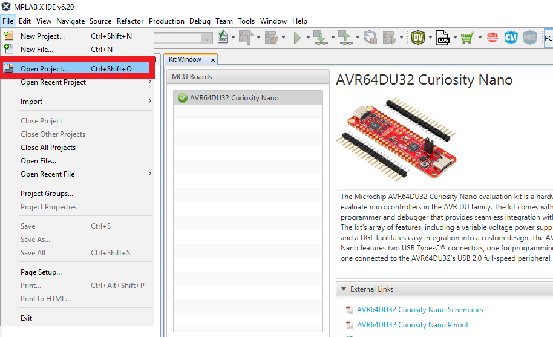
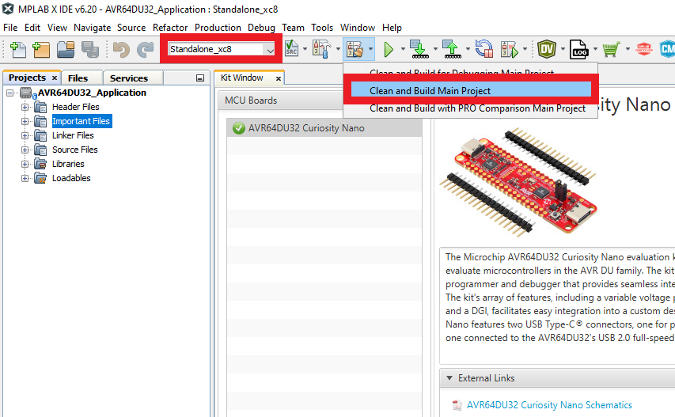
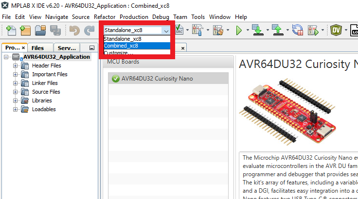

<!--  -->

<a target="_blank" href="https://www.microchip.com/" id="top-of-page">
   <picture>
      <source media="(prefers-color-scheme: light)" srcset="images/mchp_logo_light.png" width="350">
      <source media="(prefers-color-scheme: dark)" srcset="images/mchp_logo_dark.png" width="350">
      
   </picture>
</a>

# 8-Bit Microchip Device Firmware Update (MDFU) Solution for the AVR64DU32 Curiosity Nano Evaluation Kit

This configuration contains two MPLAB® X projects designed to showcase the utilization of the 8-Bit MDFU Client Library in creating an efficient development ecosystem within MPLAB® X, which also facilitates firmware updates.

## Demonstration

### Introduction

1. Bootloader Client Project:
    - UART Communication: UART is being used to transfer the new application program data from the host to the client through the debugger's CDC ports
        - Baud Rate: 115200
        - TX: PD7
        - RX: PD6
    - CRC32 Verification: The client firmware will compute a CRC32 over the application code and compare that value against a known CRC stored at an absolute address at the end of the application image
    - Entry Pin Enabled: The bootloader sequence can be initiated through a hardware pin if an expected value is read from the pin at reset
    - Indicator Pin Enabled: The client firmware will indicate if the bootloader is running by holding the LED on
    - Application Start Address is 0x4000: The client firmware is configured to install the application code at address 0x4000 and the bootloader partition will include all of PFM from address 0x0000 to 0x3FFF

2. Application Project:
    - Supports push button DFU initialization: The application firmware supports pushing the on-board switch to initiate a DFU by using the forced entry mechanism of the bootloader client
    - Supports message based DFU initialization: The application firmware supports receiving an 'r' character over the CDC ports to erase the footer data of the application and cause a DFU to be initialized
        - Baud Rate: 9600
        - TX: PD7
        - RX: PD6
    - Blinks the LED using a timer interrupt: The application firmware is configured to blink the on-board LED at a rate of 200 ms using a timer interrupt
    - Multiple project configurations: 
        - **Stand-alone Configuration:** This project configuration is used to build the firmware images that can be loaded through the client firmware
        - **Combined Configuration:** This project configuration is used to combined the bootloader firmware and the application firmware into one single hex file, which allows the debugger to be run on both projects simultaneously

### Execution

1. Open MPLAB&reg; X IDE.

2. Select *File>Open Project>AVR64DU32_Application.X*.

3. Right click AVR64DU32_Application in the **Projects** tab and select Set as Main Project.

4. Build the application configurations. 

    > **Note**: AVR® devices have two supported compilers. However, the demo steps below will be conducted using the XC8 compiler.
    
    a. Select Standalone_xc8 from the Set Project Configuration drop-down menu.

    

    b. Open Project Properties, go to *Conf: Standalone>Building* and enable the 'Execute this line after build' check box.

    
    
    c. Select **Clean and Build Main Project.**

    
    
    d. Next, select Combined_xc8 from the Set Project Configuration drop-down menu.

    

5. Open the Data Visualizer and connect to the device through the COM port connected to the on-board debugger.

6. Select **Make and Program Device Main Project** and then check the Data Visualizer console to watch the application begin running.

 

7. Send an 'r' character to the application code using the Data Visualizer to initiate a device firmware update.

 

At this point in the demonstration, the MDFU Client firmware has taken control of the MCU core and is waiting for protocol commands to be sent to it over UART. Now, the new application firmware image can be sent.

8. Disconnect from the device's serial port by clicking the red stop button available on the Data Visualizer.

9. Open the example update script file by navigating to *Projects>Important Files>run_pymdfu.bat* or *Projects>Important Files>run_pymdfu.sh* and update the serial port name in the script. Make sure to use the same name shown in the Data Visualizer.

10. Right click the script file and select Run.

 

> **IMPORTANT:** To run these update scripts from within MPLAB&reg; X, include the Python instance in the PATH variable. If the tools are not executable from within MPLAB&reg; X, run the same scripts from another terminal or reinstall the Python instance with the correct PATH configuration.

## Example Scripts

This repository has provided a collection of scripts that aim to demonstrate how to call the various Python tools used to create an efficient ecosystem.

|Script Name |Description |
|--- |--- |
| `build_image.bat`/`build_image.sh` |This script can be called by the post build step of the Standalone_xc8 application configuration to build the application binary image. It can also be run on its own, and it will assume that the application hex is found in the `dist/Standalone_xc8/production` path. |
| `run_pymdfu.bat`/`run_pymdfu.sh` |This script can be run from within MPLAB&reg; X by right clicking the script file (e.g., *Projects Tab>Important Files>run_pymdfu.bat*) and selecting Run. It can also be run as a stand-alone script but it would be just as easy to copy the command out and use it in your own terminal directly instead of running this script from your file explorer.|

## References

For additional information, refer to the following resources:

- [Getting Started, MCU8 Firmware Image Specification, API Reference, Memory Consumption Report](https://onlinedocs.microchip.com/v2/keyword-lookup?keyword=8BIT_MDFU_CLIENT&version=latest&redirect=true)
- [8-Bit MDFU Client Release Note](https://onlinedocs.microchip.com/v2/keyword-lookup?keyword=MCC.MELODY.MDFU-CLIENT-8BIT.RELEASENOTES&version=latest&redirect=true)
- [8-Bit MDFU Client Known Issues](https://onlinedocs.microchip.com/v2/keyword-lookup?keyword=KNOWN_ISSUES_8BIT_MDFU_CLIENT&version=latest&redirect=true)
- [MDFU Protocol Specification](https://ww1.microchip.com/downloads/aemDocuments/documents/DEV/ProductDocuments/SupportingCollateral/Microchip-Device-Firmware-Update-MDFU-Protocol-DS50003743.pdf)
- [AVR64DU32 Product Page](https://www.microchip.com/en-us/product/avr64du32)