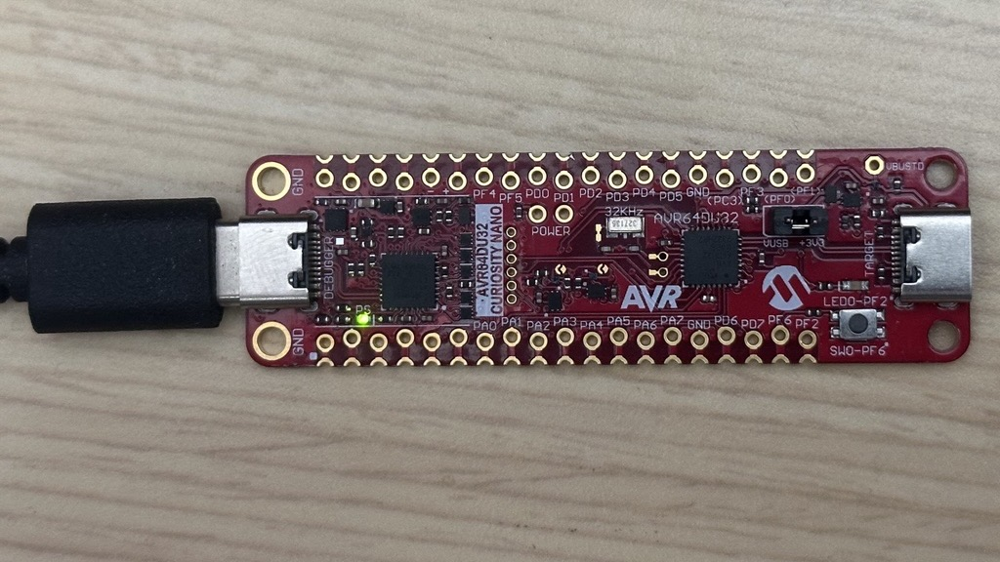

<!--  -->

<a target="_blank" href="https://www.microchip.com/" id="top-of-page">
   <picture>
      <source media="(prefers-color-scheme: light)" srcset="images/mchp_logo_light.png" width="350">
      <source media="(prefers-color-scheme: dark)" srcset="images/mchp_logo_dark.png" width="350">
      
   </picture>
</a>

# 8-Bit Microchip Device Firmware Update (MDFU) Solution for the AVR64DU32 Curiosity Nano Evaluation Kit

## Introduction

This repository contains two configurations to showcase the utilization of the 8-Bit MDFU Client library in creating an efficient development ecosystem within MPLAB® X.

Each of these configurations contains two MPLAB® X projects: the bootloader client project and the application project.

 1. [Basic Bootloader Client Solution Using UART](./README-BASIC.md)
 2. [Bootloader Client Solution Using UART With Multiple Image and Anti-Rollback Support](./README-MI-ARB.md)

## Hardware Requirements

- [AVR64DU32 Curiosity Nano Evaluation Kit (EV59F82A)](https://www.microchip.com/en-us/development-tool/EV59F82A)
- USB-A to USB-C® cable

## Software Requirements

- [MPLAB&reg; X IDE v6.25 or newer](https://www.microchip.com/en-us/tools-resources/develop/mplab-x-ide)
- [XC8 Compiler v3.00 or newer](https://www.microchip.com/en-us/tools-resources/develop/mplab-xc-compilers)
- [AVR® GCC Compiler v7.3.0 or newer](https://www.microchip.com/en-us/tools-resources/develop/microchip-studio/gcc-compilers)
- MPLAB&reg; Code Configurator (MCC) Core v5.8.2 or newer
- MCC Melody Core v2.9.1 or newer
- [MPLAB Code Configurator (MCC) Melody 8-Bit MDFU Client](https://www.npmjs.com/package/@mchp-mcc/mdfu-client-8bit)
- [Python™ v3.8 or newer](https://www.python.org/)
- [pyfwimagebuilder v1.0.1 or newer](https://pypi.org/project/pyfwimagebuilder/)
- [pymdfu v2.5.1](https://pypi.org/project/pymdfu/)
 
## Hardware Setup
1. Connect the AVR64DU32 Curiosity Nano Evaluation Kit to the PC using a USB-A to USB-C cable.

2. To create the AVR® BOOT/APPCODE/APPDATA partitions using the FUSE bits, newer AVR® CNANO devices need to have their FUSE bits unlocked using a Python tool that interfaces with the on-board debugger.

    a. Install Python 3.

    b. Run the package installation command from a command line interface with access to Python:

        pip install pydebuggerconfig

    c. Run the read command to check the device's configuration. Check to see that the FUSE_PROTECTION bit in the TARGET_DEBUG_FEATURES register is set.

        $> pydebuggerconfig read

        ----- Board Configuration read from the board: -----
        ...
        ...
        ...
        Register TARGET_DEBUG_FEATURES:   0x0F (15)  # Program/debug features
                                            bit 0, SINGLE_DEVICE: 1 # Single-device
                                            bit 1, PROG_ENABLED: 1 # Programming
                                            bit 2, DEBUG_ENABLED: 1 # Debug
                                            bit 3, FUSE_PROTECTION: 1 # Fuse protection    <<<< Fuse protection is enabled
        ...
        ...
        ...

    d. Disable the Fuse Configuration Protection by running:

        pydebuggerconfig replace -r TARGET_DEBUG_FEATURES=0x07

    e. Verify that the Fuse Protection has been disabled by reading back the new data.

        $> pydebuggerconfig read

        ----- Board Configuration read from the board: -----
        ...
        ...
        ...
        Register TARGET_DEBUG_FEATURES:   0x07 (7)  # Program/debug features
                                            bit 0, SINGLE_DEVICE: 1 # Single-device
                                            bit 1, PROG_ENABLED: 1 # Programming
                                            bit 2, DEBUG_ENABLED: 1 # Debug
                                            bit 3, FUSE_PROTECTION: 0 # Fuse protection    <<<< Fuse protection is disabled
        ...
        ...
        ...

> **Note**: If needed, the Fuse Configuration Protection can be re-enabled by issuing the command `pydebuggerconfig restore` to reset the debugger to factory default settings. However, this command will only restore the factory settings of the debugger and will not reset the device's Fuse values. A changed Fuse value will be held until the debugger protection is disabled once again and the device is reprogrammed.

## References

For additional information, refer to the following resources:

- [Getting Started, MCU8 Firmware Image Specification, API Reference, Memory Consumption Report](https://onlinedocs.microchip.com/v2/keyword-lookup?keyword=8BIT_MDFU_CLIENT&version=latest&redirect=true)
- [8-Bit MDFU Client Release Note](https://onlinedocs.microchip.com/v2/keyword-lookup?keyword=MCC.MELODY.MDFU-CLIENT-8BIT.RELEASENOTES&version=latest&redirect=true)
- [8-Bit MDFU Client Known Issues](https://onlinedocs.microchip.com/v2/keyword-lookup?keyword=KNOWN_ISSUES_8BIT_MDFU_CLIENT&version=latest&redirect=true)
- [MDFU Protocol Specification](https://ww1.microchip.com/downloads/aemDocuments/documents/DEV/ProductDocuments/SupportingCollateral/Microchip-Device-Firmware-Update-MDFU-Protocol-DS50003743.pdf)
- [AVR64DU32 Product Page](https://www.microchip.com/en-us/product/avr64du32)

[Back to Top](#8-bit-microchip-device-firmware-update-mdfu-solution-for-the-avr64du32-curiosity-nano-evaluation-kit)
